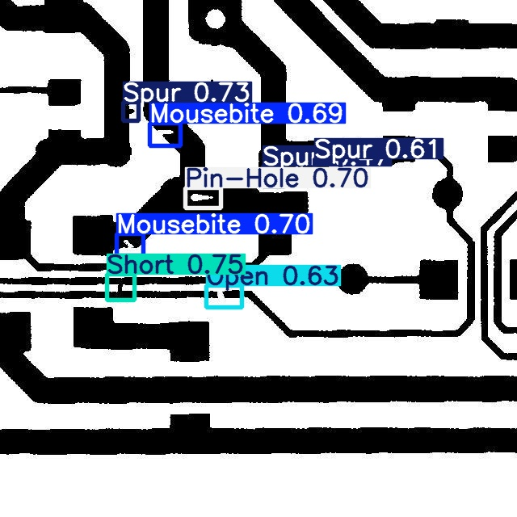
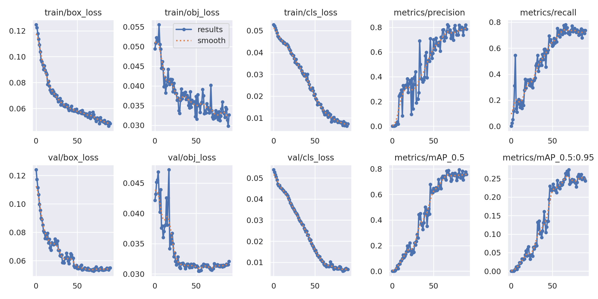

# 🛠️ PCB Defect Detection using YOLOv5

This project was developed using the YOLOv5 architecture to automatically detect manufacturing defects in circuit boards (PCBs). The dataset was labeled using Roboflow, and the model was trained in Google Colab. The repo contains Python code supporting the training and testing processes.

---

## 📌 Project Features

- ✅ Custom PCB dataset labeled with Roboflow
- ✅ Training and prediction with YOLOv5 (PyTorch)
- ✅ Easy training and test scripts via the command line
- ✅ Visualization of inference outputs
- ✅ Automatic naming of training logs

---

## 📁 Folder Structure
pcb-defect-detection-yolov5/
├── yolov5/ # YOLOv5 codes (cloned from ultralytics)
├── dataset/
│ └── data.yaml # data.yaml obtained from Roboflow
├── Results/ # Results of trainings with different data sets and epochs
├── scripts/
│ ├── train_pcb_model.py # Training script
│ └── run_inference_pcb.py # Prediction (inference)
│ └── example_prediction.jpg # Example prediction visual 
└── README.md
